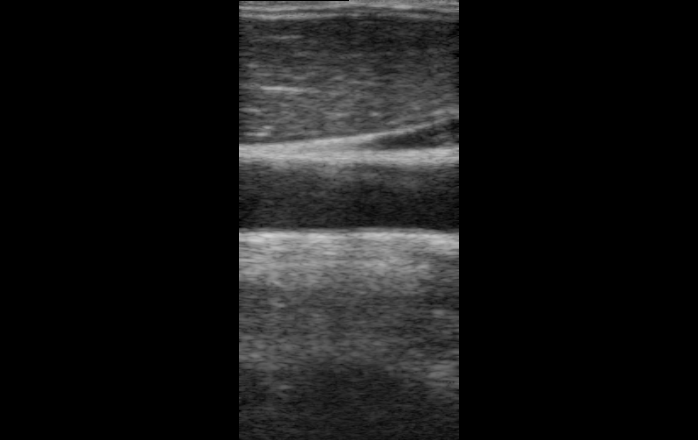
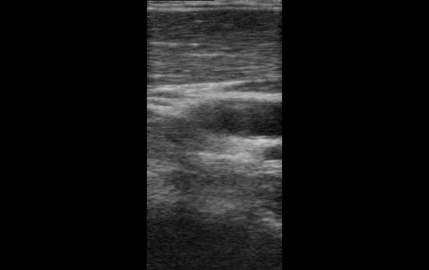
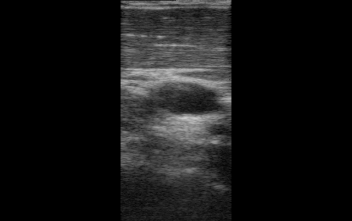
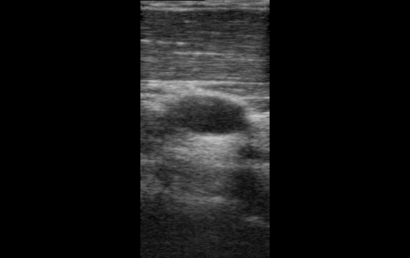

# Predict Object Angle Value Based on Dataset of Ultrasound Images with ResNet-18
This project use ResNet-18 for regression task of predicting the angle of carotid images in ultrasound images. The datasets is in a form of CSV containing pairs of ultrasound images and the corresponding angle value recorded with IMT sensor.

# Linear Regression
Linear Regression is a statistical method used to define linear relationship between a dependent and one or more independent variables. In this project, we successfully recorded a sequence of moving ultrasound video, storing them as small frames. Along with each frame, is the angle produce by the IMT sensor according to the current position of the probe. Each of the video is store as frame sequence in one folder. Video is recorded when the carotid artery is shown lying horizontally with a full view. The next frames are the continuous rotation of the probe, while keeping the carotid artery in view. To create the dataset, we assume that the first frame of each folder to have the angle of 0 because the carotid artery lies in horizontal axis, we then adjust the angle of the other frame according to this. Here are some carotid images taken from different angles.

# ResNet-18
This project uses ResNet-18 as the pre-trained model. While ResNet-18 is mainly use for image classification, we can also adapt it to work for regression tasks by modifying the final layer to output a single continuous value instead of class labels.

